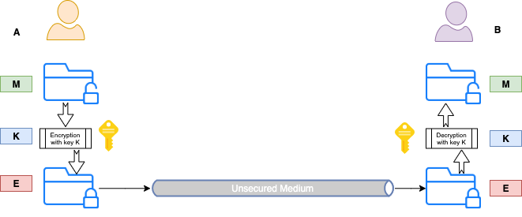
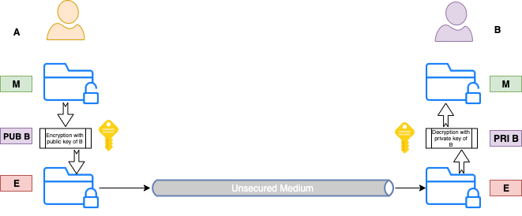
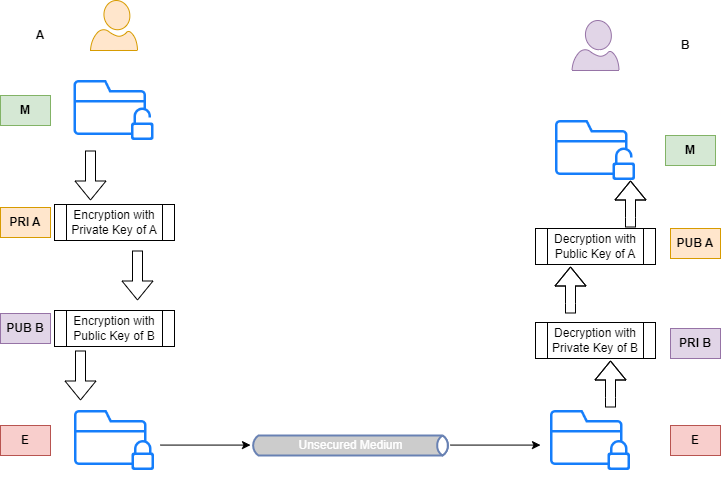

# PKI 101

Public Key Infrastructure, aka PKI, is a set of roles, procedures and policies used to manage digital certificates and public key encryption. The end goal is to provide a secure method of exchaning information between parties.

## Public Key Cryptography

### Symmetric Encryption

With symmetric encryption, the same key is used for both encryption and decryption. So if A wants to send B the raw message M, it will use the key K to generate the encrypted message E. When B receives the encrypted message E, it will use the same key K to decrypt it and it will get the raw message M.

<figure><figcaption>
Symmetric Encryption
</figcaption></figure>

As you can see, both A and B must have a shared key provided to both of them ahead of time. Hence the term usually used for this aproach: using a pre-shared key (or secret). It's biggest flaw is that secure methods to share the key are hard to find or implement.

### Asymmetric Encryption (PKC)

With asymmetric encryption, aka Public Key Cryptography (PKC), there is one key used in the encryption process and another key used in the decryption process. Therefore, we have a key-pair.

The two keys in the pair are called private-key and public-key. As the name suggests, a public-key can be shared with anyone but the private-key should only be known to the entitiy it belongs to.

<figure><figcaption>
Asymmetric Encryption
</figcaption></figure>

The keys in the key-pair must have certain characteristics in order to be viable. This is done via a mathematical relationship between the private-key and the public-key. The most important characteristic of this relationship is that messages encrypted with the public-key can only be decrypted with the private-key. It doesn't work the other way around and it is computationaly unfeasable to deduce the private-key from the public-key or other data exchanged between the parties. The method used to exchange the key information between parties is known as Diffie-Hellman and RSA (Rivest-Shamir-Adleman) is an implementation of this method.

The DH method is mostly used to secretly agree on a shared key between the parties envolved in a data exchange. Once the shared key is established, it is further used to encrypt the messages exchanged between parties because symmetric encryption is a much simpler process and through this method, it's biggest flaw - sharing the secret - is addressed

## Digital Signatures

When A wants to communicate with B the public and private keys of each can encrypt the messages between them but the identity of A and B needs to be proved as well.

The digital signage process can be used as a proof of identity. A will encrypt its credentials with its private key. Only its' public key can decrypt this. Then A will use the public key of B to encrypt the resulting message. This part can only be decrypted by B's private key.

When B receives the message it uses it's private key to decrypt but it will get an unreadable message. B then tries to decrypt using the public key of A and this way it can get to the original message.

<figure><figcaption>
Digital Signatures
</figcaption></figure>

## Certificate Authorities

We now have a mechanism to encrypt messages and to authenticate each side but how can we make sure that it's not someone else providing it's own public key instead of one of the intended participants. We can have a mechanism to pre-share the public key but that can have a lot of weaknesses or we can use a thirdy party service that both sides trust. This thirdy party service is called a Certificate Authority (CA)
